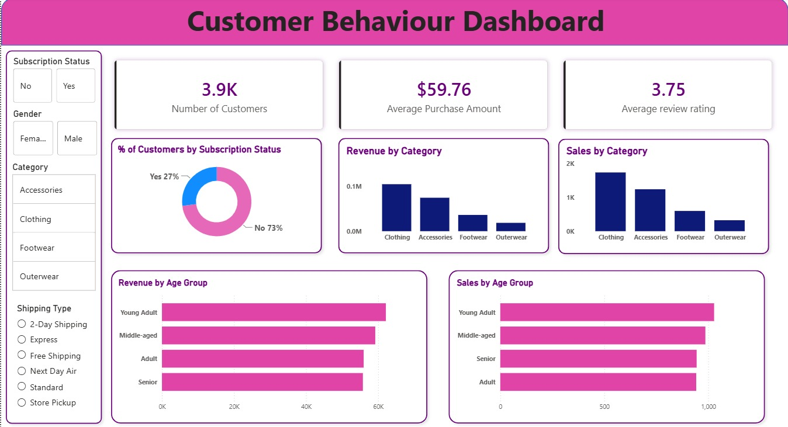

# Retail Customer Behavior Analysis

### End-to-End Data Analytics Project using Python, PostgreSQL, SQL & Power BI

---

## 📌 Project Overview

This project analyzes retail customer shopping behavior to uncover purchasing trends, customer preferences, revenue drivers, and loyalty patterns.

The objective is to transform raw transactional data into actionable business insights that help improve customer engagement, optimize marketing strategies, and support data-driven decision-making.

### Analytics Workflow

Python → PostgreSQL → SQL Analysis → Power BI Dashboard → Business Insights

---

## 🎯 Business Problem

A retail company wants to better understand its customers' shopping behavior to improve sales performance, customer satisfaction, and long-term loyalty.

Management is particularly interested in understanding how factors such as demographics, discounts, customer reviews, payment methods, subscription status, shipping preferences, and seasonal trends influence purchasing decisions.

### Key Business Question

> How can the company leverage consumer shopping data to identify trends, improve customer engagement, and optimize marketing and product strategies?

---

## 🛠️ Tools & Technologies

| Tool | Purpose |
|--------|---------|
| Python | Data Cleaning & Transformation |
| Pandas | Data Manipulation |
| PostgreSQL | Database Management |
| SQL | Data Analysis & Querying |
| Power BI | Dashboard Development |
| Git & GitHub | Version Control |

---

## 🔄 Project Workflow

### 1. Data Preparation (Python)

- Cleaned and transformed raw customer shopping data
- Handled inconsistencies and prepared the dataset for analysis
- Structured data for efficient database storage

### 2. Database Management (PostgreSQL)

- Imported cleaned data into PostgreSQL
- Created a structured environment for querying and business analysis

### 3. Business Analysis (SQL)

- Performed exploratory and business-focused SQL analysis
- Investigated customer behavior, spending habits, loyalty trends, and revenue drivers
- Developed additional custom SQL queries beyond the guided project workflow

### 4. Data Visualization (Power BI)

- Designed an interactive dashboard to visualize customer and revenue trends
- Created KPI cards, category analysis, and demographic insights
- Enabled dynamic filtering for deeper business exploration

---

## 📊 Dashboard Preview

---

## 🔍 SQL Analysis Performed

The dataset was analyzed using SQL to answer key business questions related to customer behavior, revenue generation, loyalty, and purchasing trends.

### Customer & Revenue Analysis

- Total revenue generated by male vs female customers
- Highest-value customers by gender
- Revenue contribution by age group
- Revenue contribution by product category
- Locations contributing the highest sales

### Product Performance Analysis

- Top-rated products based on customer reviews
- Best-reviewed product within each category
- Most purchased products within each category
- Products with the highest percentage of discounted purchases

### Customer Behavior & Loyalty Analysis

- Spending patterns of subscribed vs non-subscribed customers
- Relationship between repeat buyers and subscription status
- Customer segmentation based on previous purchases
- Customer segmentation based on spending behavior

### Sales & Purchasing Trends

- Impact of discounts on customer spending
- Comparison of spending across shipping methods
- Payment methods generating the highest revenue
- Seasonal revenue and purchasing trends

---

## 📈 Dashboard Highlights

The Power BI dashboard provides interactive insights into:

- Customer Demographics
- Revenue by Product Category
- Sales Distribution by Category
- Revenue by Age Group
- Sales by Age Group
- Subscription Status Analysis
- Customer Review Ratings
- Dynamic Filtering by Category, Gender, Subscription Status, and Shipping Type

---

## 📄 Detailed Report

The repository also contains a detailed PDF report covering:

- SQL Queries and Results
- Dashboard Walkthrough
- Business Insights
- Business Recommendations

Please refer to **Retail Customer Behaviour Analysis Report.pdf** for the complete analysis.

---

## 💡 Key Business Insights

- Certain product categories contribute significantly more revenue than others.
- Customer spending behavior varies across demographic groups.
- Subscription status influences purchasing patterns.
- Discounts play an important role in customer spending decisions.
- Payment preferences impact transaction behavior.
- Seasonal trends affect overall sales performance.
- High-value customer segments can be identified for targeted marketing initiatives.

---

## 🚀 Skills Demonstrated

- Data Cleaning & Transformation
- Exploratory Data Analysis (EDA)
- SQL Query Writing
- PostgreSQL Database Management
- Customer Segmentation
- Revenue Analysis
- Business Intelligence
- Dashboard Development
- Data Visualization
- Data Storytelling
- Business Reporting

---

## 📚 Project Background

This project was developed as a hands-on learning exercise to strengthen practical skills in Python, PostgreSQL, SQL, and Power BI.

In addition to the guided workflow, independent SQL analyses were performed to explore customer value, payment behavior, geographic sales distribution, spending segments, category performance, and seasonal purchasing trends.

---

## 👨‍💻 Author

**Ojal Agarwal**

B.Tech Computer Science Engineering

Aspiring Data Analyst | Python | SQL | PostgreSQL | Power BI
